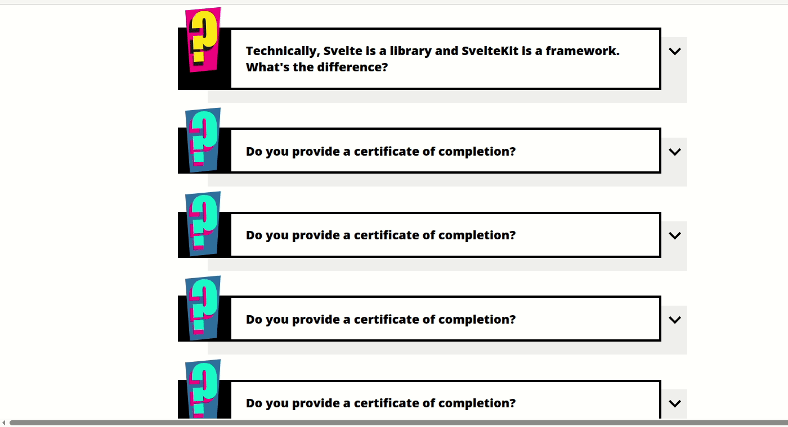

# FAQ Accordion Using DOM Element Geometry in JavaScript  
Interactive FAQ accordion powered by `scrollHeight` and pure JavaScript.

This project showcases dynamic manipulation of element geometry in JavaScript. It uses a FAQ accordion interface to demonstrate how the `scrollHeight` property can be used to animate height transitions for expanding and collapsing content blocks with smooth, UX-friendly behavior.

## 🧩 Key Features

- Dynamic expansion and collapse of answers  
- Utilizes `scrollHeight` to calculate actual content height  
- Smooth CSS animations on open and close  
- Semantic HTML structure  
- Pure JavaScript without any libraries  

## 🧠 Core Idea: Element Geometry

The accordion measures each answer panel’s **natural content height** using `element.scrollHeight`, then sets that value to the panel’s inline `height` style to animate its opening. To collapse, it sets `height: 0`.

```js
const blockWithContentHeight = li.querySelector(".answer").scrollHeight;
li.querySelector(".answer").setAttribute("style", `height: ${blockWithContentHeight}px;`);

🔍 How it works:

Markup: Each FAQ item is a <li> with a clickable question and a hidden answer block.

CSS transitions: The answer has height: 0, overflow: hidden, and smooth transition effects on height and background-color.

JS toggle logic: On click, the script toggles the expand class on the <li>, sets the calculated height to open, and resets to 0px to close.

🛠 Tech Stack

HTML5

CSS3

Vanilla JavaScript

📚 Learning Objectives

This project was created to reinforce understanding of:

Accessing DOM geometry properties like scrollHeight, offsetTop, etc.

Handling DOM events

Dynamically applying inline styles

Creating CSS-based animations

🔧 How to Run

Simply open index.html in your browser — no server needed.

📷 Demo

This GIF demonstrates the smooth opening and closing of answers using scrollHeight and animation classes.


🔗 Author

Antonina Kachusova on GitHub 
